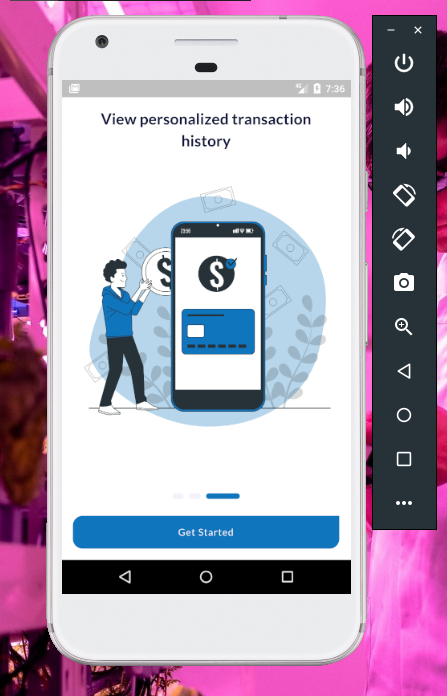
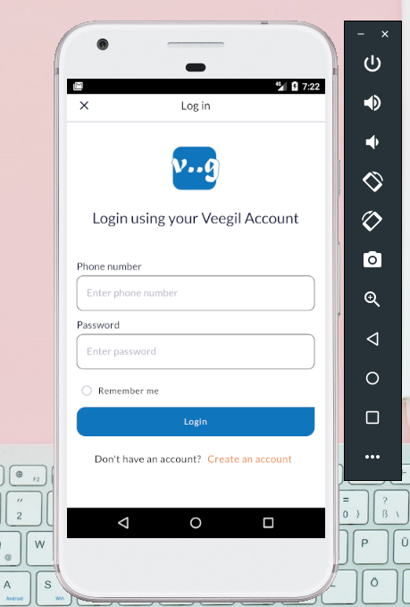
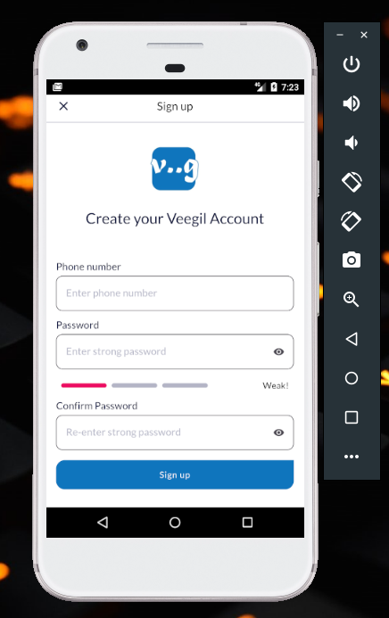
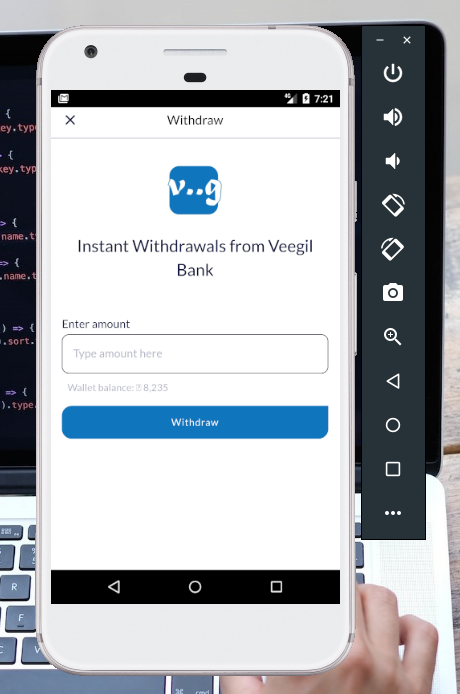
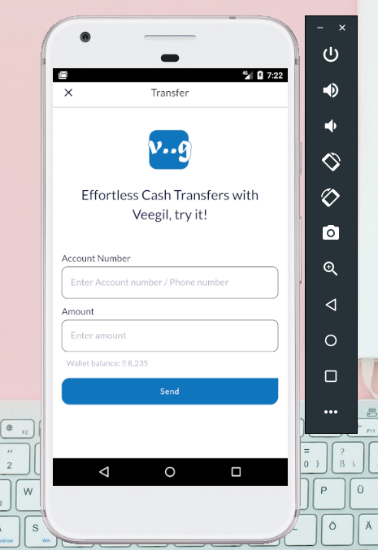
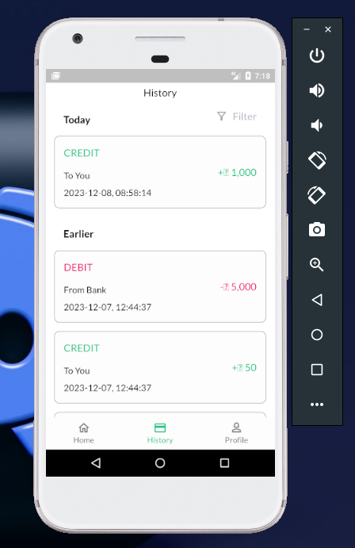

# SendMoney Bank App

This README file provides an overview of the Banking App with features included as instructions stated below developed for the technical assessment at Veegil Technologies

## Getting Started

To get started with the project, follow the steps below:

### Prerequisites

- **Flutter SDK**: Install the latest stable version of Flutter. The project uses this constraints: SDK >=3.0.5 <4.0.0. But installing the latest version of Flutter would run everything just fine.
- **Android Tools**: The app targets Android API level **30** (this should have been updated to target the latest, but time didn't allow for that), so ensure that you have installed Android command line tools and everything related to it using Android Studio
- **Dart**: Ensure you have Dart programming language installed along with the Flutter SDK.
- **IDE**: Choose an Integrated Development Environment (IDE) for Flutter development.

### Installation

1. Clone the project repository using the following command:

   ```
   git clone https://gitlab.com/noahweasley/veegil.git
   ```
2. Navigate to the project directory:

   ```
   cd veegil
   ```
3. Fetch the dependencies by running the following command:

   ```
   flutter pub get
   ```

## Build Tools

These are some of the tools used to build the application:

- To generate code used in Json encoding and decoding, the flutter package; build_runner was used to ensure speed up development and reduce errors, running these commands below ensure that:

  ```shell
  dart run build_runner build --delete-conflicting-outputs
  ```

  To run the build runner once. This will ensure that code generation is run, and has generated any required files.

  OR

  ```shell
  dart run build_runner watch --delete-conflicting-outputs
  ```

  To run the build runner and watch for future changes.
- Run launcher icon generation, flutter_launcher_icons package was used by running the command below:

  ```shell
  dart run flutter_launcher_icons
  ```

## Running the App For Debugging

To run the application, execute the following command in the project directory:

```
flutter run
```

_This will launch the application on an available emulator or connected device_

Visit this page: [How to Run Flutter app on android emulator](https://docs.flutter.dev/get-started/test-drive)

## Testing

**Tests weren't implemented for this project because of the time frame. The project includes only an empty test**

## Building the app

This project was tested on Web, and works on Android, iOS should work, but wasn't tested on the device. Making network calls on the app using Web generate errors because CORS isn't enabled.

### Building for Android

To build for Android without splitting the ABIs, execute the following command in the project directory:

```
flutter build apk
```

To build for Android splitting the ABIs, execute the following command in the project directory:

```
flutter build apk --split-abis
```

_Gradle download and some other project configurations would be performed in the background, so make sure you are connected to a stable internet connection_

## Project Structure

This section states the overall structure of the app, the architecture, working principle, logic, trade-offs and design of the UI

### SDK and Libraries

The banking application was built using Flutter. State management and Routing was built using GetX, Network API calls where made using Dio, and Local storage to disk was built using Hive.

### Architecture

The project uses a feature based folder structure, to ensure that if the application features grows, the complexity of the application remains reduced, basically structured as:

- api
  - repositories
  - services
    - enums
    - exceptions
    - helpers
    - requests
    - resources
    - responses
- core
  - constants
  - database
    - adapters
    - objects
  - navigation
  - utilities
    - extensions
  - validators
  - widgets
- features
  - authentication
    - controllers
    - screens

_Where_:

- **api**: represents every logic relating to request to the banking apis are stored
- **core**: represents the majority of the reusable components are stored. Components that are used throughout the app
- **features**: represents the individual features in the app as can be categorized by the user. Authentication is a feature and each feature has two sub-folders; **controllers** and **screens**. **controllers** is where the business logic of each screen are stored, while, **screens** are the UI displayed to the user in the app.

## App Design

This section aims to help the one assessing this, understand the thought process, design and every other thing concerning the app

### On boarding screen

This screen aims to help user view the features of the app



### Authentication (Login and Signup)

This screen aims to help user login and signup





### Withdrawal

This demo screen was just an addition, and does not apply to a real world application, to see how withdrawal could be done in a real app



### Top-up

This screen aims to help user top-up their account


### Transfer

Users can transfer to other Veegil user and the money is debited from their account



### Transaction History

This screen aims let user view their transaction history



### Visualization of Transaction History

This screen aims to visualize the monthly spending of the registered user. The blue bars in the bar chart represents the credits for a single month, while the red bar represents the debit for a single month


## Conclusion

This readme provides a brief overview of the Flutter project, including setup instructions, project structure, and additional resources.
